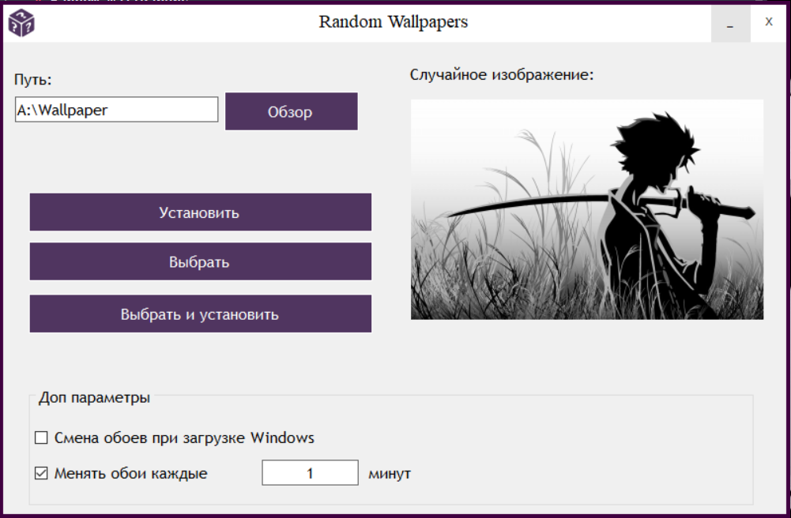
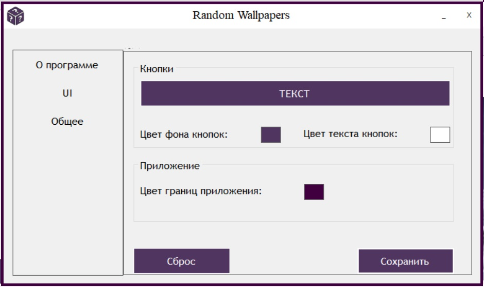

# Random WallPapers

## Версия
> 2.1

## Описание
> Приложение для автоматизации смены обоев рабочего стола 

> Приложение может менять обои: 

	> При запуске системы 

	> Через N минут

> В новой версии добавлено:
	
	> Истори выбранных каталогов

	> Настройки вынесены в отдельное окно

	> В настройках доступна кастомизация

### Требования:
	> ОС: Windows 7 и выше

	> Разрешение экрана: 1600x900 и выше

#### Дополнительная информация:

	> Антивирус может ругаться на программу так как используется библиотека user32, а так же работа с реестром(для автозапуска)
